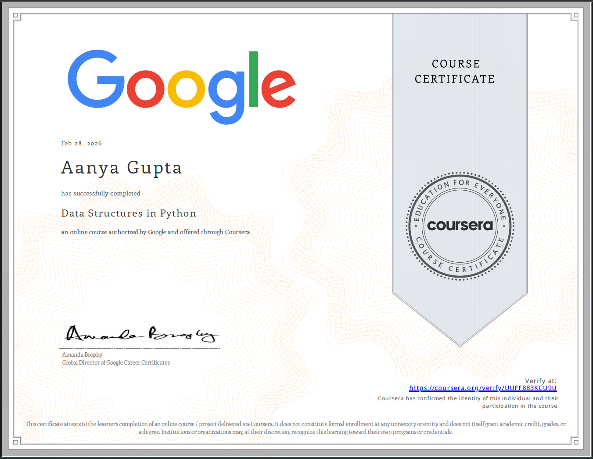
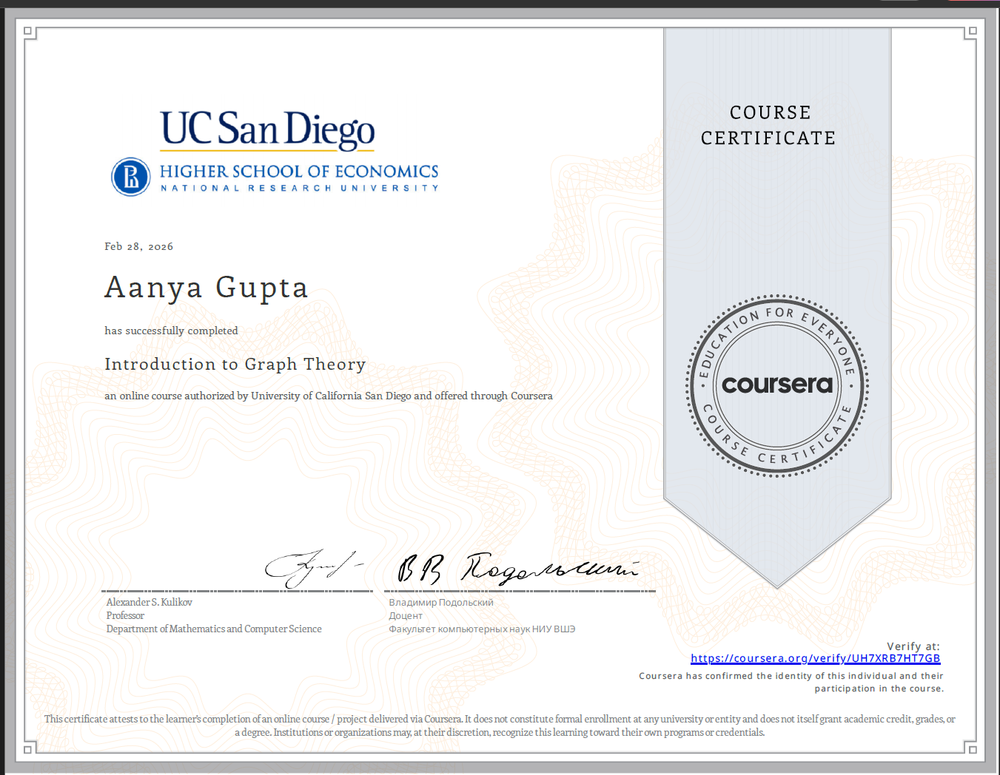

## 👋 Hi there!

My name is **Aanya Gupta**. I'm a grade 5 student with a passion for maths and technology. Here are some of my interests and areas I'm exploring:

- 🧮 **Maths** — My favourite subject!
- 🐍 **Python Coding** — Learning to code and build projects with Python.
- 🔐 **Cryptography** — Exploring how to encrypt and protect information.
- 🤖 **Machine Learning & Reasoning** — Interested in AI and smart systems.
- 🦾 **Robotics** — Building and programming robots for fun and learning.
- ⚛️ **Physics** — Discovering how the world works through experiments and theory.
- 🖥️ **Computer Architecture** — Curious about how computers work inside.
- 📚 **Data Structures & Algorithms** — Learning problem-solving and coding techniques.
- 🛡️ **Post-Quantum Cryptography** — Exploring the future of secure communication.

I'm always excited to learn new things and take on interesting challenges. If you share any of these interests, feel free to connect or collaborate!

---

# My Learning Achievements

## Feb 2028

### Data Structures

I completed a [course on Data Structures](https://www.coursera.org/account/accomplishments/verify/UUFF883KCU9U)

### Graph Theory

I completed a [course on Graph Theory](https://www.coursera.org/account/accomplishments/verify/UH7XRB7HT7GB)

